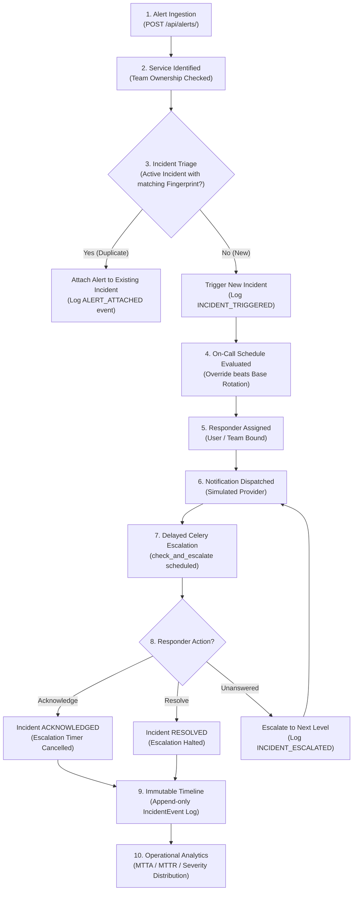

# Incident Management Platform

A deterministic, production-grade incident management platform providing automated alert ingestion, fingerprint-based deduplication, on-call scheduling with overrides, tiered multi-level escalation policies, simulated notification delivery, and incident lifecycle management with an immutable audit timeline.

---

## Overview

The Incident Management Platform coordinates emergency response workflows during production incidents. It receives monitoring alerts from upstream systems, groups them deterministically into incidents to prevent alert fatigue, identifies the active on-call responder for the affected service, dispatches notifications, and automatically escalates unacknowledged incidents according to configurable policies. Every action is recorded in an immutable, append-only timeline, powering real-time operational analytics (MTTA / MTTR)

---

## Core Workflow



---

## Key Capabilities

- **Service & Team Ownership**: Monitored services explicitly owned by operational teams with assigned roles (`ENGINEER`, `LEAD`, `RESPONDER`).
- **Generic Alert Ingestion & Fingerprinting**: Ingests JSON alerts, normalizes source and message, and computes deterministic SHA-256 digests.
- **Active Incident Deduplication**: PostgreSQL partial unique constraint (`UniqueConstraint` on `service` + `fingerprint` where `resolved_at IS NULL`) guarantees exactly one active incident per issue without duplicate alert fatigue.
- **Incident State Machine**: Explicit transitions (`TRIGGERED` -> `ACKNOWLEDGED` -> `RESOLVED`), with full support for reopening resolved incidents.
- **Immutable Timeline**: Append-only event store (`IncidentEvent`) capturing all transitions, alert links, responder assignments, and escalation milestones.
- **On-Call Scheduling & Overrides**: Half-open intervals `[start, end)` for rotation shifts, with temporary overrides taking strict precedence over base rotations.
- **Tiered Escalation Policies**: Multi-level escalation policies supporting `CURRENT_ON_CALL` or specific `USER` targets with configurable delay timers.
- **Celery Asynchronous Execution**: Delayed escalation timers and bounded notification retries with exponential backoff.
- **Three-Guard Safety Model**: Live status check, expected escalation level check, and `automation_generation` epoch counters eliminate race conditions and stale task execution.
- **Operational Frontend**: React 18 SPA with live Dashboard, Incident Workbench, Detail view with interactive Timeline, Service configuration, On-call viewer, and Analytics.
- **Authoritative Operational Analytics**: Mean Time to Acknowledge (MTTA) and Mean Time to Resolve (MTTR) calculated authoritatively by the backend.

---

## Architecture

The system implements a classic decoupled three-tier architecture:

```
React 18 + Vite SPA (Client Layer)
        │
        │ REST / JSON (HTTP Port 8000)
        ▼
Django 5 + Django REST Framework (Domain Authority)
        │
        ├──────────────────────► PostgreSQL 16 (Single Source of Truth)
        │
        ▼
Redis 7 (In-Memory Broker)
        │
        ▼
Celery 5 Workers (Asynchronous Task Engine)
        │
        └──────────────────────► PostgreSQL 16 (select_for_update)
```

### Component Responsibilities
- **React (Port 5173)**: Thin presentation client using TanStack Query for caching and optimistic updates; contains zero domain logic.
- **Django REST Framework (Port 8000)**: Sole authoritative domain controller; enforces business rules, serialization, validation, and database transactions.
- **PostgreSQL 16 (Port 5432)**: Single source of truth; enforces database-level integrity, partial unique indexes, foreign key protections, and ACID transactions.
- **Redis 7 (Port 6379) & Celery 5**: Manages asynchronous timers, delayed escalation checks, bounded retries, and notification dispatch.

*For deep architectural details, see [`docs/ARCHITECTURE.md`](./docs/ARCHITECTURE.md).*

---

## Tech Stack

| Component | Technology | Version | Purpose |
| :--- | :--- | :--- | :--- |
| **Backend Framework** | Django | 5.1.x | Domain logic and ORM authority |
| **REST API** | Django REST Framework | 3.15.x | Serializers, ViewSets, and API contracts |
| **Database** | PostgreSQL | 16-alpine | ACID transactions, partial unique indexes |
| **Message Broker** | Redis | 7-alpine | Celery task queue broker |
| **Task Queue** | Celery | 5.4.x | Delayed escalation timers, retry backoffs |
| **Frontend Framework** | React | 18.3.x | UI components and views |
| **Language** | TypeScript | 5.5.x | Type safety across frontend contracts |
| **Bundler & Dev Server**| Vite | 5.4.x | Fast build tool and development server |
| **Server State Management** | TanStack Query | 5.56.x | Client caching, refetching, and mutations |
| **Styling** | Tailwind CSS | 3.4.x | Utility-first responsive design |
| **Backend Testing** | Pytest / Pytest-Django | 8.3.x / 4.9.x | Unit, race condition, and failure tests |
| **Frontend Testing** | Vitest / Testing Library | 2.1.x / 16.0.x | Component and hook unit test suite |
| **Linter / Formatter** | Ruff (Backend) / ESLint (Frontend) | Latest | Code style and static analysis |
| **Containerization** | Docker / Docker Compose | Latest | Reproducible development and evaluation stack |

---

## Repository Structure

```
incident-platform/
├── README.md                 # Primary reviewer document & overview
├── docker-compose.yml        # Multi-container Docker stack configuration
├── .env.example              # Template environment configuration
├── .gitignore                # Git exclusions (Python, Node, DB, IDE, test output)
├── docs/                     # Detailed technical documentation
│   ├── ARCHITECTURE.md       # Deep architectural dive and state machine design
│   ├── API.md                # Complete REST API specification
│   ├── TESTING.md            # Testing architecture and test suite guide
│   ├── DEMO.md               # 5-minute step-by-step reviewer runbook
│   └── SUBMISSION_CHECKLIST.md # Technical verification checklist
├── skills/                   # Genuine AI engineering skills and runbooks
│   ├── README.md             # Skills index
│   ├── incident-triage-verification/
│   ├── on-call-boundary-testing/
│   ├── escalation-safety-audit/
│   └── full-system-golden-flow/
├── transcripts/              # Authentic session milestone transcripts
│   ├── README.md             # Transcript index & privacy certification
│   ├── phase-00-skeleton.md
│   ├── ...
│   └── phase-12-hardening.md
├── e2e/                      # End-to-end integration workflows
│   ├── README.md
│   └── test_e2e_workflows.py
├── backend/                  # Django backend application
│   ├── Dockerfile
│   ├── manage.py
│   ├── pyproject.toml        # Unified backend metadata & pytest config
│   ├── requirements.txt      # Production dependencies
│   ├── requirements-dev.txt  # Testing & development dependencies
│   ├── config/               # Settings, URLs, and Celery app
│   └── apps/                 # 8 Domain applications
│       ├── users/            # Users, Teams, Memberships
│       ├── services/         # Services
│       ├── alerts/           # Alerts, Fingerprinting, Triage
│       ├── incidents/        # Incidents, Deduplication, Timeline
│       ├── scheduling/       # Schedules, Rotations, Overrides
│       ├── escalation/       # Policies, Levels, Celery Tasks
│       ├── notifications/    # Notifications & Dispatch
│       └── analytics/        # MTTA & MTTR calculations
└── frontend/                 # React 18 TypeScript frontend
    ├── Dockerfile
    ├── package.json
    ├── package-lock.json
    ├── vite.config.ts
    ├── tsconfig.json
    └── src/
        ├── api/              # Typed REST client
        ├── components/       # Shared UI components & layout
        ├── hooks/            # TanStack Query custom hooks
        ├── pages/            # Operational pages (Dashboard, Incidents, etc.)
        └── types/            # TypeScript domain types
```

---

## Quick Start

### 1. Clone and Configure
```bash
git clone https://github.com/santheesh73/PagerDuty.git
cd PagerDuty

cp .env.example .env
```

### 2. Boot the Docker Stack
```bash
docker compose up -d --build
```
This initializes all 5 services:
- PostgreSQL (database migrations run automatically on startup)
- Redis
- Django REST API
- Celery Worker
- React Frontend

### 3. Seed Demonstration Data
```bash
docker compose exec backend python manage.py seed_demo
```
*The seed command is fully idempotent and can be executed multiple times safely.*

---

## Demo Data

Running `python manage.py seed_demo` sets up an active operational environment:
- **Users**: `alice` (Engineer), `bob` (Lead), `charlie` (Responder).
- **Teams**: `Backend Team`, `Platform Team`, `SRE Team`.
- **Services**: `Payment API`, `Authentication API`, `Notification Delivery API`.
- **On-Call Schedule**: `Backend Primary` schedule with base rotations for Alice and Bob, plus an active override shift for Bob.
- **Escalation Policy**: `Backend Critical Policy` with 3 levels:
  - Level 1: Current On-Call responder (immediate).
  - Level 2: Alice (after 5 minutes).
  - Level 3: Bob (after 10 minutes).
- **Sample Incidents**: 3 pre-seeded incidents in `TRIGGERED`, `ACKNOWLEDGED`, and `RESOLVED` states.

---

## Using the Application

### 1. Ingest a Monitoring Alert
Simulate an upstream alert from an external monitoring system:
```bash
curl -X POST http://localhost:8000/api/alerts/ \
  -H "Content-Type: application/json" \
  -d '{
    "service": 1,
    "severity": "CRITICAL",
    "message": "Payment Gateway 504 Gateway Timeout",
    "source": "PaymentGatewayMonitor",
    "metadata": {"endpoint": "/v1/charge", "latency_ms": 15200}
  }'
```

### 2. Operational Web UI Walkthrough
Open **[http://localhost:5173](http://localhost:5173)** in your browser:
1. **Dashboard (`/`)**: View system-wide operational metrics, active incident counts, and recent timeline activity.
2. **Incidents (`/incidents`)**: Filter incidents by status (`TRIGGERED`, `ACKNOWLEDGED`, `RESOLVED`) and severity.
3. **Incident Detail (`/incidents/{id}`)**: Inspect assigned responder, current escalation level, attached alerts, and the immutable event timeline.
   - Click **Acknowledge**: Stops escalation timers and marks status `ACKNOWLEDGED`.
   - Click **Resolve**: Marks status `RESOLVED` and records resolution time.
4. **On-Call Schedule (`/schedules`)**: View active shift rotations, live responders, and override windows.
5. **Services (`/services`)**: View monitored services, health status, and bound escalation policies.
6. **Escalation Policies (`/escalation-policies`)**: Inspect multi-tiered escalation levels and reorder escalation steps.
7. **Analytics (`/analytics`)**: Inspect authoritative MTTA, MTTR, and incident severity distributions.

*For a complete 5-minute reviewer walkthrough, see [`docs/DEMO.md`](./docs/DEMO.md).*

---

## API / Application URLs

| Interface | URL | Description |
| :--- | :--- | :--- |
| **Frontend Web App** | `http://localhost:5173` | React / Vite operations interface |
| **Backend API Root** | `http://localhost:8000/api/` | Django REST Framework API root |
| **Health Endpoint** | `http://localhost:8000/api/health/` | Real-time PostgreSQL and Redis health check |
| **Django Admin** | `http://localhost:8000/admin/` | Administrative backend interface |
| **API Specification** | See [`docs/API.md`](./docs/API.md) | Authoritative REST contract reference |

---

## Testing

The platform maintains 100% passing test coverage across backend, frontend, and integration suites:

### 1. Backend Test Suite (218 Tests)
```bash
# Inside Docker
docker compose exec -T backend pytest

# Check linters and migrations
docker compose exec -T backend ruff check .
docker compose exec -T backend python manage.py check
docker compose exec -T backend python manage.py makemigrations --check
```

### 2. Frontend Test Suite (73 Tests)
```bash
cd frontend
npm run typecheck   # TypeScript compiler check
npm run lint        # ESLint check
npm test            # Vitest suite
npm run build       # Production bundle build
```

### 3. End-to-End Integration Suite
```bash
python e2e/test_e2e_workflows.py
```
*Validates full workflow from Alert Ingestion -> Responder Assignment -> Notification -> Acknowledge -> Resolve -> Timeline -> Analytics.*

*For complete testing documentation, see [`docs/TESTING.md`](./docs/TESTING.md).*

---

## Important Engineering Decisions

1. **PostgreSQL Partial Unique Constraint for Active Deduplication**: Rather than application-level locks, deduplication is enforced by PostgreSQL:
   ```python
   UniqueConstraint(fields=["service", "fingerprint"], condition=Q(resolved_at__isnull=True))
   ```
   This guarantees that high-concurrency alert storms cannot produce duplicate active incidents.
2. **Preservation of Deduplicated Alert Rows**: All incoming alerts are persisted in the `Alert` table even when deduplicated into an existing incident, preserving full telemetry for post-mortems.
3. **Three-Guard Celery Safety Model**: Celery tasks reload the incident using `select_for_update()` and verify:
   - Live status == `TRIGGERED`.
   - Escalation level == `expected_level`.
   - Automation generation == `expected_generation`.
   Duplicate deliveries, out-of-order executions, and stale tasks are dropped as no-ops.
4. **Half-Open Intervals for Schedules**: Rotations and overrides use $[T_{\text{start}}, T_{\text{end}})$ semantics, ensuring zero overlap or gap at the exact microsecond of shift changes.
5. **Override Precedence**: Temporary overrides take strict precedence over base rotations without destructive modification of the underlying recurring rotation.
6. **Immutable Event Sourcing**: `IncidentEvent` records are strictly append-only (`on_delete=models.PROTECT`). No updates or deletions are permitted.
7. **Simulated Notification Provider Abstraction**: Notifications are persisted in the database and dispatched through a pluggable provider interface, allowing robust retry testing without external telephony dependencies.

---

## Edge Cases / Reliability Guarantees

- **Concurrent Duplicate Ingestion**: 10 threads submitting the same alert concurrently resolve to exactly 1 incident, 1 `INCIDENT_TRIGGERED` event, and 10 attached alerts (`apps/incidents/tests/test_races.py`).
- **Simultaneous Acknowledgement**: 3 users clicking Acknowledge simultaneously: first write wins, exactly 1 `INCIDENT_ACKNOWLEDGED` event recorded; subsequent calls are idempotent.
- **Concurrent Acknowledge vs Resolve Race**: If Acknowledge and Resolve race concurrently, the incident is guaranteed to end in `RESOLVED` state with `acknowledged_at <= resolved_at`.
- **Concurrent Resolve vs Escalation Race**: Row-level locking blocks any in-flight escalation task from progressing once an incident resolution has committed.
- **Stale Generation Task Protection**: Resolving and reopening an incident increments `automation_generation`. Lingering Celery tasks from previous open cycles are discarded immediately.
- **Exhaustion of Escalation Levels**: When an incident reaches the final policy level without acknowledgement, it logs `ESCALATION_EXHAUSTED` cleanly once without unhandled exceptions.
- **Midnight & DST Transitions**: Evaluated using strict UTC timestamps without ambiguity or skipped hours during Daylight Saving Time adjustments.

---

## Intentional Scope Limits

To preserve architectural focus, reliability, and simplicity, the following items are intentionally out of scope:
- **Real Telephony Integrations**: Twilio SMS/voice calls and PagerDuty mobile pushes are simulated via an in-database notification provider abstraction.
- **ChatOps Integrations**: Native Slack/Microsoft Teams bots are excluded.
- **WebSockets / Server-Sent Events**: Real-time frontend updates rely on TanStack Query polling and explicit query cache invalidation.
- **Complex Hierarchical RBAC**: Authentication is structured around three core operational team roles (`ENGINEER`, `LEAD`, `RESPONDER`).
- **Distributed Lock Managers**: Concurrency control relies entirely on PostgreSQL ACID row-level locking (`select_for_update`) rather than external distributed lock managers (e.g. Redlock).

---

## AI-Assisted Development Artifacts

The engineering lifecycle of this platform was assisted by AI tools following rigorous engineering standards:
- **Skills Directory (`skills/`)**: Contains genuine operational runbooks and testing procedures authored during development:
  - [`incident-triage-verification`](./skills/incident-triage-verification/SKILL.md)
  - [`on-call-boundary-testing`](./skills/on-call-boundary-testing/SKILL.md)
  - [`escalation-safety-audit`](./skills/escalation-safety-audit/SKILL.md)
  - [`full-system-golden-flow`](./skills/full-system-golden-flow/SKILL.md)
- **Transcripts Directory (`transcripts/`)**: Contains authentic session records extracted from the system trajectory logs across Phases 0 through 12. All entries have been certified for privacy and secrets. See [`transcripts/README.md`](./transcripts/README.md).

---

## Project Status

- **Phase 0–12**: Complete, verified, and hardened.
- **Phase 13**: Submission Engineering & Repository Finalization complete.
- **Architecture**: Frozen.
- **Test Results**: 218 Backend tests passing, 73 Frontend tests passing, 3 End-to-End integration scenarios passing.
- **Submission Readiness**: 100% reproducible from a clean clone with zero undocumented steps.
