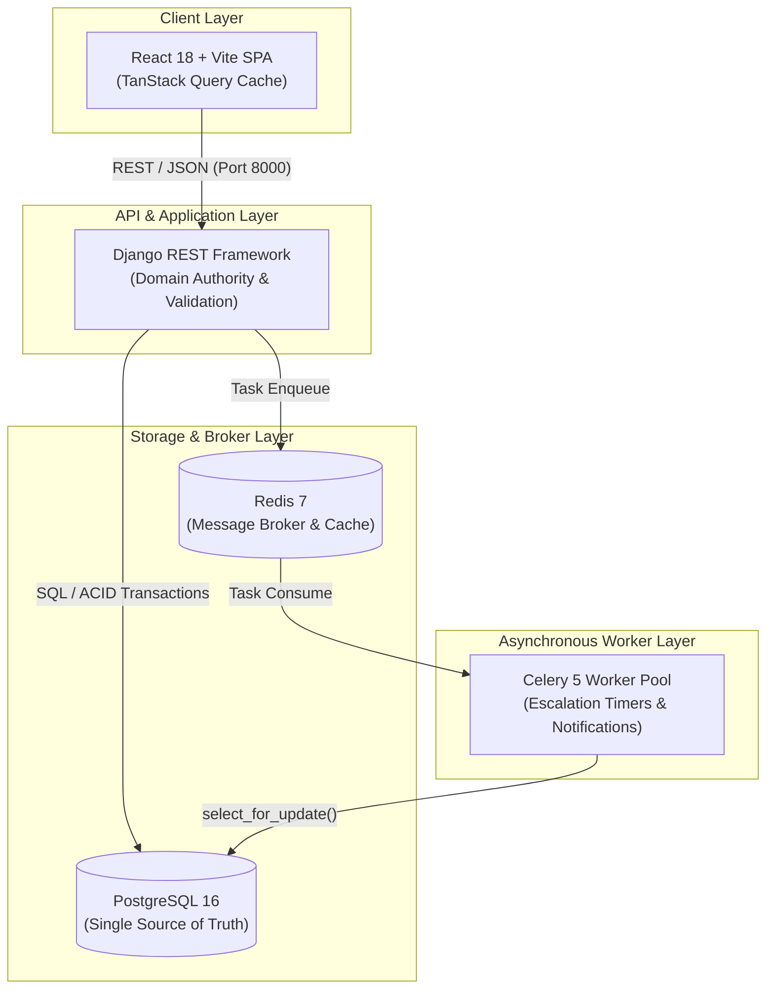
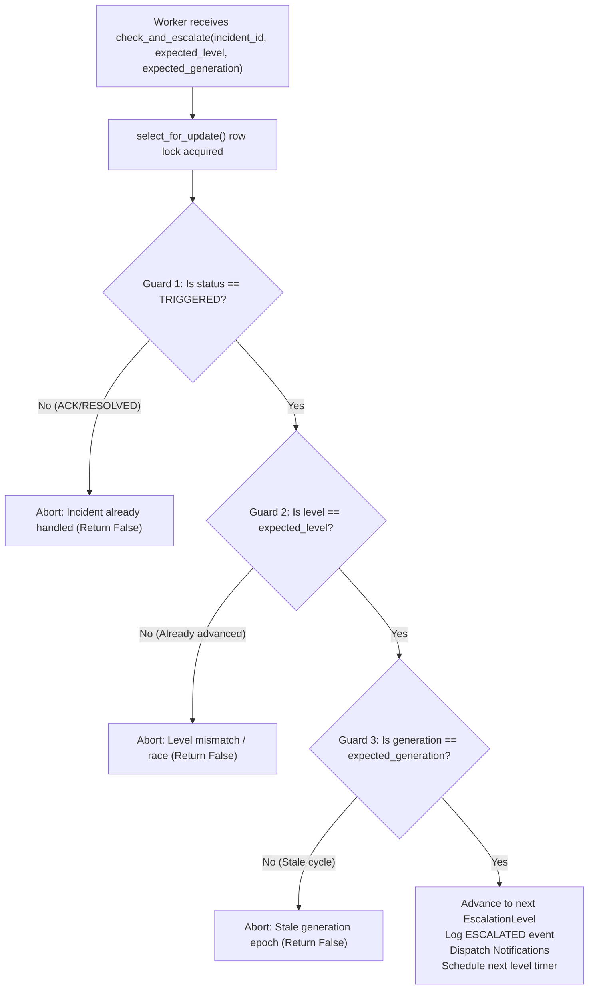

# System Architecture & Engineering Design

This document details the architectural principles, domain boundaries, state machines, and concurrency safety guarantees implemented across the Incident Management Platform.

---

## 1. System Topology & Responsibilities

The system implements a classic, robust three-tier architecture with decoupled asynchronous worker processing:



### Separation of Concerns
1. **React Client**: Strictly a thin view and presentation layer. It manages client-side caching and optimistic UI invalidation via TanStack Query. It contains zero business logic, workflow rules, or state calculations.
2. **Django / DRF**: The sole authoritative domain controller. It enforces business rules, input sanitization, database transactions, state machine transitions, and audit logging.
3. **PostgreSQL**: The single source of truth. All entities, audit events, and constraints (including partial unique indexes) are enforced at the database level.
4. **Redis & Celery**: Dedicated asynchronous task pipeline for delayed escalation timers, retry backoffs, and simulated external notifications.

---

## 2. Domain Boundaries

The application is decomposed into eight cohesive Django domain apps:

| Domain App | Responsibility | Key Models & Services |
| :--- | :--- | :--- |
| **`apps.users`** | Identity, teams, and team memberships. | `User`, `Team`, `TeamMembership` |
| **`apps.services`** | Monitored operational components and service health. | `Service` |
| **`apps.alerts`** | External alert ingestion, normalization, and fingerprinting. | `Alert`, `ingest_alert()`, `generate_fingerprint()` |
| **`apps.incidents`** | Incident lifecycles, active deduplication, and immutable audit logging. | `Incident`, `IncidentEvent`, `triage_alert()`, `acknowledge_incident()`, `resolve_incident()` |
| **`apps.scheduling`** | On-call schedules, base rotations, overrides, and responder resolution. | `Schedule`, `ScheduleRotation`, `get_on_call()` |
| **`apps.escalation`** | Escalation policies, multi-level escalation timers, and Celery dispatch. | `EscalationPolicy`, `EscalationLevel`, `check_and_escalate()` |
| **`apps.notifications`**| Notification records, retry tracking, and simulated provider delivery. | `Notification`, `NotificationLog`, `send_notification_task()` |
| **`apps.analytics`** | Authoritative Mean Time to Acknowledge (MTTA) and Resolve (MTTR) metrics. | `AnalyticsSummaryView`, `get_team_analytics()` |

---

## 3. Concurrency Safety & Deduplication

### Active Incident Partial Unique Constraint
To guarantee that recurring alerts for the same underlying issue do not generate duplicate open incidents, PostgreSQL enforces a partial unique constraint:
```python
UniqueConstraint(
    fields=["service", "fingerprint"],
    condition=models.Q(resolved_at__isnull=True),
    name="unique_active_incident_service_fingerprint",
)
```
- **Behavior**: While an incident with fingerprint `F` for service `S` is unresolved (`resolved_at IS NULL`), any concurrent ingestion attempting to create a second incident triggers an `IntegrityError`.
- **Triage Synchronization**: `triage_alert()` catches `IntegrityError` and safely falls back to retrieving the active incident and attaching the alert via an `ALERT_ATTACHED` event.

### Multi-Actor State Transitions
All incident state transitions (`acknowledge_incident`, `resolve_incident`, `reopen_incident`) execute inside `transaction.atomic()` with row-level locks:
```python
incident = Incident.objects.select_for_update().get(id=incident_id)
```
- **First-Write-Wins**: The first actor to acknowledge or resolve succeeds. Subsequent simultaneous calls detect that the incident is already in the target state and return idempotently without duplicate event logging.

---

## 4. Celery Escalation Safety Model

Asynchronous tasks executing in distributed workers are vulnerable to duplicate delivery, race conditions, and network delays. To maintain 100% correctness without distributed locking, Celery tasks implement **The Three Safety Guards**:



### Automation Generation Epochs
When an incident is resolved and subsequently reopened:
1. `reopen_incident()` increments `incident.automation_generation` (e.g. from `1` to `2`).
2. Any delayed Celery tasks from the previous open cycle still lingering in the Redis broker carry `expected_generation=1`.
3. When they execute, Guard 3 detects `generation (2) != expected_generation (1)` and drops the task immediately with zero side-effects.

---

## 5. Schedule Evaluation & Half-Open Intervals

On-call rotations and temporary overrides are evaluated using half-open intervals:
$$\text{Interval} = [T_{\text{start}}, T_{\text{end}})$$

- **Start Precision**: A timestamp exactly at $T_{\text{start}}$ matches the shift.
- **End Precision**: A timestamp exactly at $T_{\text{end}}$ transitions immediately to the subsequent shift or `None`.
- **Precedence Hierarchy**:
  1. Temporary `ScheduleRotation` with `is_override=True`.
  2. Base `ScheduleRotation` with `is_override=False`.
  3. Escalation policy fallback (if configured).

---

## 6. Immutable Event Sourcing

Every incident maintains an append-only audit trail in the `IncidentEvent` model:
- Events cannot be modified or deleted (`on_delete=models.PROTECT`).
- Supported event types:
  - `INCIDENT_TRIGGERED`
  - `ALERT_ATTACHED`
  - `INCIDENT_ACKNOWLEDGED`
  - `INCIDENT_RESOLVED`
  - `INCIDENT_REOPENED`
  - `ESCALATION_STARTED`
  - `INCIDENT_ESCALATED`
  - `ESCALATION_EXHAUSTED`
  - `ESCALATION_TARGET_UNAVAILABLE`
