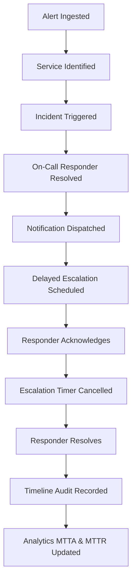

# Full-System Golden Flow Skill

## Purpose
This skill provides the authoritative checklist and automated verification procedure to execute the complete end-to-end incident response lifecycle across all platform subsystems.

## The Golden Workflow Sequence

## Verification Steps
1. **Health Verification**:
   - Check `GET /api/health/` returns `status: ok` with dependencies `database: ok` and `redis: ok`.
2. **Alert Ingestion**:
   - Post sample critical alert to `/api/alerts/`.
   - Confirm incident creation with status `TRIGGERED`.
3. **Responder Assignment**:
   - Confirm incident has `assigned_user` matching the active on-call schedule rotation or override.
4. **Timeline & Notifications**:
   - Verify `INCIDENT_TRIGGERED`, `ALERT_ATTACHED`, and `ESCALATION_STARTED` events exist on the timeline.
   - Verify a notification row is recorded in `SENT` or `PENDING` state.
5. **State Progression**:
   - Execute `POST /api/incidents/{id}/acknowledge/` -> status becomes `ACKNOWLEDGED`.
   - Execute `POST /api/incidents/{id}/resolve/` -> status becomes `RESOLVED`.
6. **Analytics**:
   - Check `GET /api/analytics/summary/` to verify resolved counts, MTTA, and MTTR are accurately reflected.
